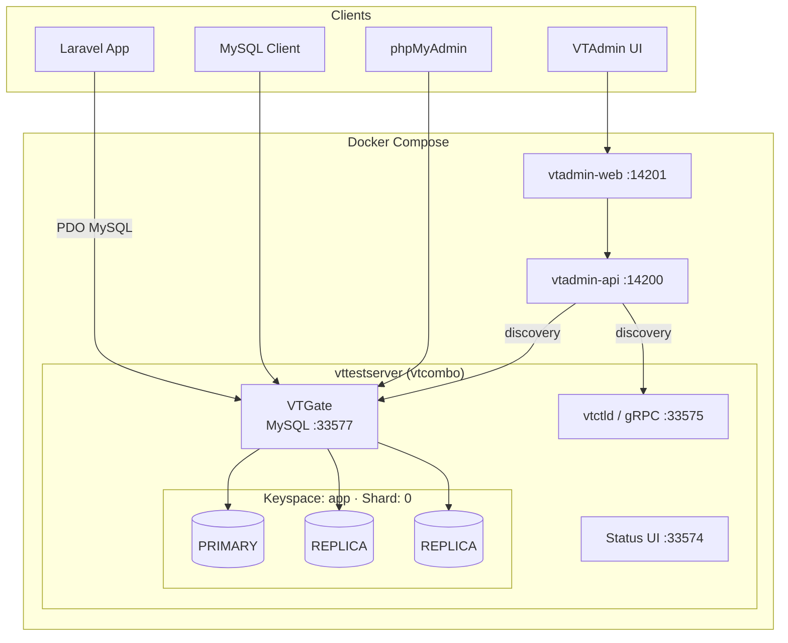
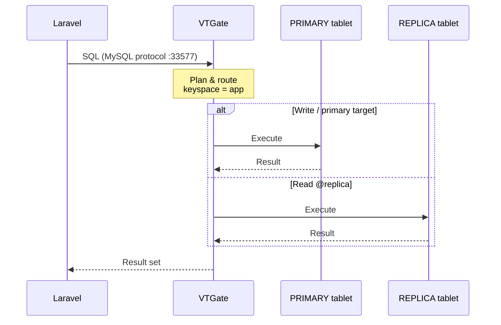
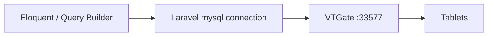

# Vitess Replication + Laravel

A Laravel application backed by [Vitess](https://vitess.io/) using the official [vttestserver Docker image](https://vitess.io/docs/24.0/get-started/vttestserver-docker-image/). The stack provides a single keyspace with **one primary** and **two replicas**, exposed to the app through VTGate’s MySQL protocol.

---

## Architecture



### Request flow



### Topology

| Concept | Value |
|---------|--------|
| Keyspace (logical DB) | `app` |
| Physical database | `vt_app_0` |
| Shards | `1` (`0`) |
| Tablets | 1 PRIMARY + 2 REPLICA |
| Planner | Gen4 |

---

## Ports

| Port | Service | Purpose |
|------|---------|---------|
| `33577` | VTGate | MySQL protocol — Laravel & clients connect here |
| `33575` | vtcombo gRPC | VTAdmin / vtctld API |
| `33574` | Status UI | Cluster debug page |
| `14201` | VTAdmin web | Optional admin UI |
| `14200` | VTAdmin API | Optional admin API |
| `8080` | phpMyAdmin | Optional SQL UI |

---

## Prerequisites

- Docker & Docker Compose
- PHP 8.2+ and Composer (for the Laravel app)

---

## Quick start

### 1. Start Vitess

```bash
docker compose up -d
docker compose ps
```

Wait until the `vitess` service is **healthy**, then open the status page:

- http://localhost:33574/debug/status

### 2. Configure Laravel

Copy environment defaults and point the app at VTGate:

```bash
cp .env.example .env
php artisan key:generate
```

Relevant `.env` values:

```env
DB_CONNECTION=mysql
DB_HOST=127.0.0.1
DB_PORT=33577
DB_DATABASE=app
DB_USERNAME=root
DB_PASSWORD=
```

### 3. Migrate & run

```bash
php artisan config:clear
php artisan migrate
php artisan serve
```

Connectivity check route:

```text
GET /vitess
```

---

## Project layout

```text
.
├── docker-compose.yml          # Vitess + optional UI profiles
├── docker/vitess/
│   ├── run.sh                  # vttestserver flags (replicas, keyspace, …)
│   └── vtadmin/
│       ├── discovery.json      # VTAdmin static discovery (vtctld + vtgate)
│       ├── nginx.conf
│       └── copy-assets.sh
├── config/database.php         # MySQL defaults → VTGate :33577 / keyspace app
├── routes/web.php              # Includes GET /vitess health query
└── .env.example
```

---

## Connecting to Vitess

### MySQL CLI

```bash
docker exec -it vitess mysql --host=127.0.0.1 --port=33577 --user=root
```

```sql
-- Target the primary (writes)
USE app@primary;

CREATE TABLE IF NOT EXISTS test (
  id BIGINT PRIMARY KEY,
  note VARCHAR(64)
);

INSERT INTO test VALUES (1, 'from primary');

-- Target a replica (reads)
USE app@replica;
SELECT * FROM test;

-- Physical schema on the shard
SHOW TABLES FROM vt_app_0;
```

### How Laravel uses Vitess

Laravel uses a normal MySQL PDO connection. There is no Vitess-specific PHP package.



- **Host / port** — VTGate (`127.0.0.1:33577`)
- **Database** — keyspace name `app`
- Routing (primary vs replica) can be selected in SQL with `USE app@primary` / `USE app@replica` when using the CLI or raw sessions

---

## Optional UIs

### phpMyAdmin

```bash
docker compose --profile ui up -d
```

Open http://localhost:8080 (host `vitess`, port `33577`).

### VTAdmin

```bash
docker compose --profile vtadmin up -d
```

| Surface | URL |
|---------|-----|
| UI | http://localhost:14201 |
| API | http://localhost:14200 |

Discovery is configured in `docker/vitess/vtadmin/discovery.json` so VTAdmin can resolve vtctld and VTGate inside the Compose network.

---

## Useful commands

```bash
# Follow Vitess logs
docker logs -f vitess

# Stop everything (keep data volume)
docker compose --profile ui --profile vtadmin down

# Stop and remove data volume
docker compose --profile ui --profile vtadmin down -v
```

---

## References

- [Vitess documentation](https://vitess.io/docs/)
- [vttestserver Docker image](https://vitess.io/docs/24.0/get-started/vttestserver-docker-image/)
- [VTAdmin cluster discovery](https://vitess.io/docs/24.0/reference/vtadmin/cluster_discovery/)
